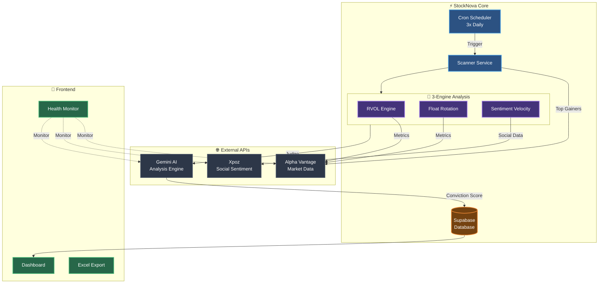
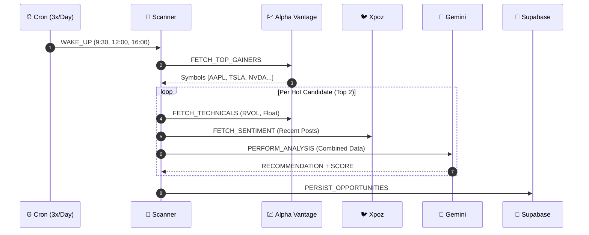
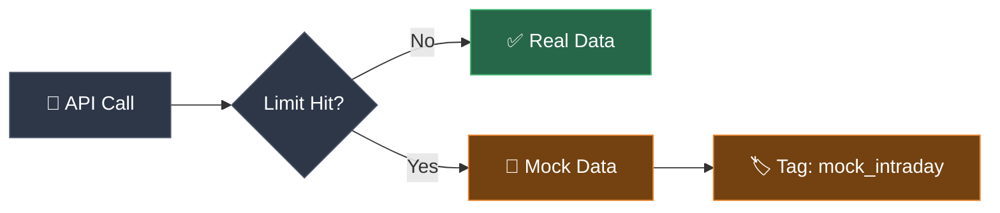

# StockNova 2.0 Architecture

This document provides visual diagrams of the StockNova trading intelligence platform.

## System Overview

## Data Flow Sequence

## API Limit Strategy

| Component | Calls/Scan | 3 Scans/Day |
|-----------|------------|-------------|
| Discovery | 1 | 3 |
| Deep Dive (2 tickers × 3 calls) | 6 | 18 |
| **Total** | **7** | **21** |

> ✅ Fits within 25 calls/day free tier limit

## Mock Mode

When API limits are hit, the system automatically switches to mock data:

