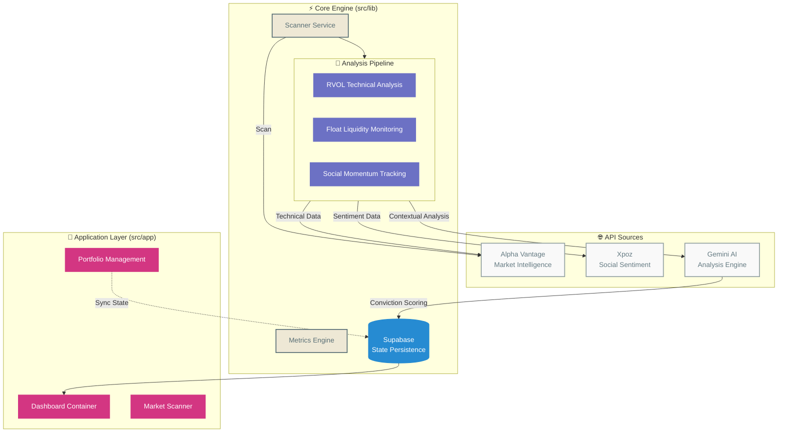
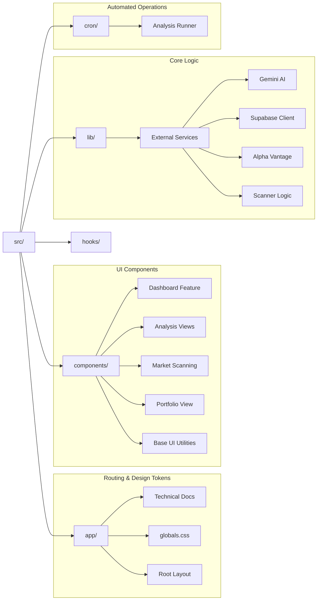
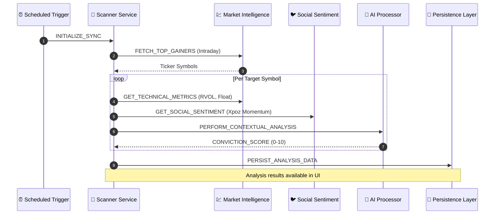

# 🏗️ StockTracker Architecture

This document provides a technical overview of the StockTracker platform, detailing its core components, data flow, and codebase organization.

## 🌌 System Overview

StockTracker is an autonomous stock analysis platform built with a modular, serverless architecture. It optimizes for real-time market data processing and sentiment analysis to provide objective trading insights.

## 📁 Codebase Structure

The project directory is structured for maintainability and scalability, separating core logic from UI components.

## 🌊 Data Analysis Sequence

The analysis pipeline transforms raw market data into structured convictions through a multi-step process.

## 🚥 API Reliability & Resilience

The platform includes resilience features to handle API availability and rate limiting.

| Source | Status | Resilience Strategy | Availability |
|--------|-----------|----------------|---------------------|
| Alpha Vantage | ✅ Active | Request Throttling | High |
| Xpoz | ✅ Active | Polling with Fallback | Medium |
| Gemini AI | ✅ Active | Error Recovery | High |

---
> "Objective, data-driven analysis for the modern market."
> 
> *Version: Phase 5 (Release Alpha)*
