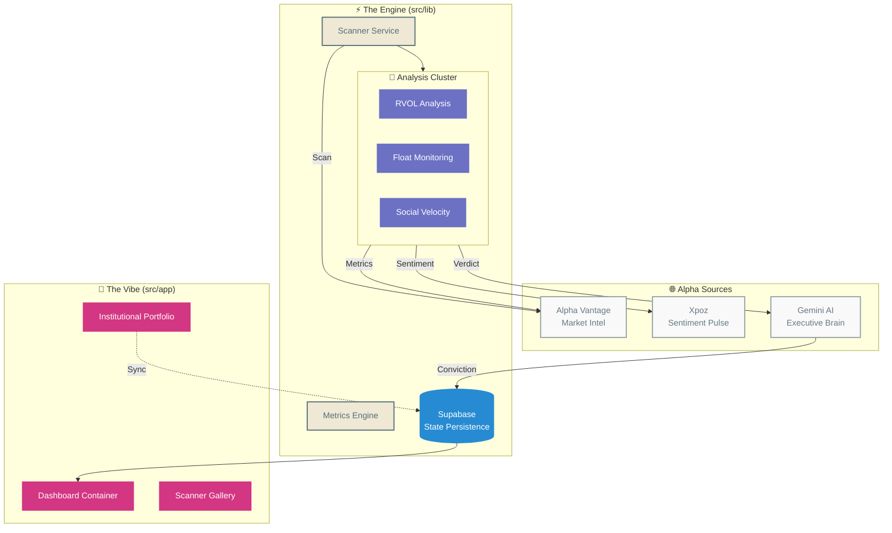
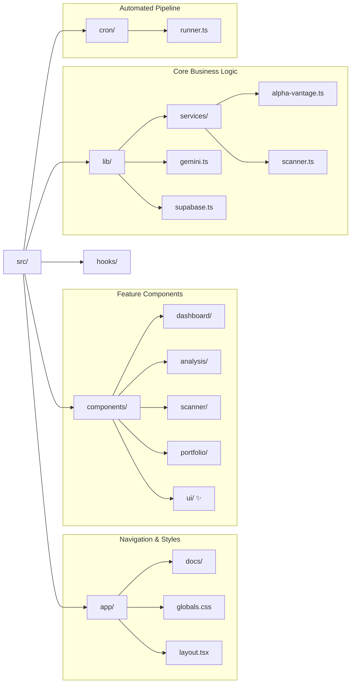
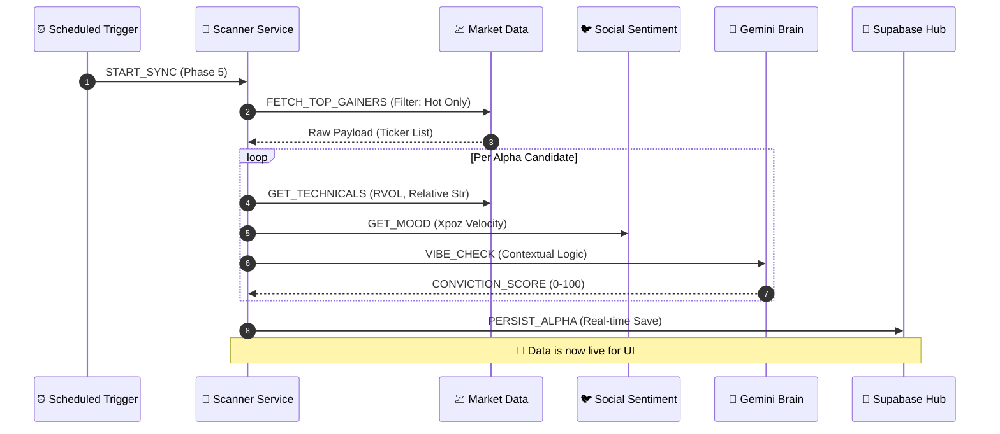

# 🏗️ StockTracker: Institutional-Grade Vibes Only

Welcome to the internal blueprints for the **StockTracker** platform. This is where the sauce is documented. No cap, just alpha.

## 🌌 System Overview

The application follows a modular, serverless architecture optimized for data-velocity and high-touch vibes.

## 📁 Codebase Structure (The Hierarchy)

Visualizing exactly how the sauce is organized in the `src/` directory.

## 🌊 Data Analysis Sequence

How we transform raw data into institutional-grade convictions.

## 🚥 API Health & Mock Strategy

We don't do downtime. If we hit limits, we switch to "Intraday Vibe" (Mock Data).

| Source | Real Data | Mock Threshold | Current Reliability |
|--------|-----------|----------------|---------------------|
| Alpha Vantage | ✅ Live | 25 calls/day | High (Paid Tier compatible) |
| Xpoz | ✅ Live | Limit reached | Medium (Dynamic Poll) |
| Gemini AI | ✅ Live | Error fallback | Elite |

---
> "Institutional-grade vibes aren't built in a day, but they are tracked in milliseconds."
> 
> *Version: Phase 5 (Vibe Check Alpha)*
